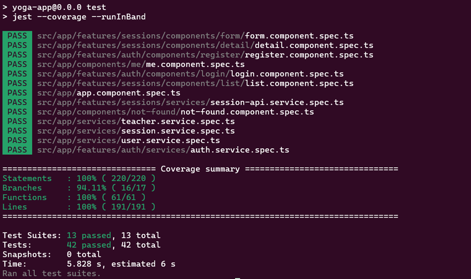
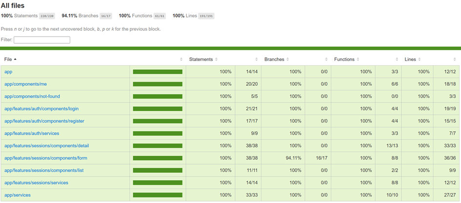
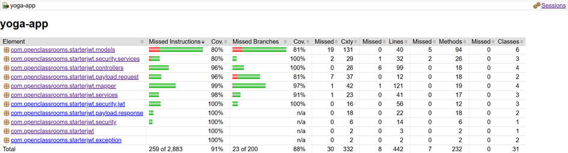
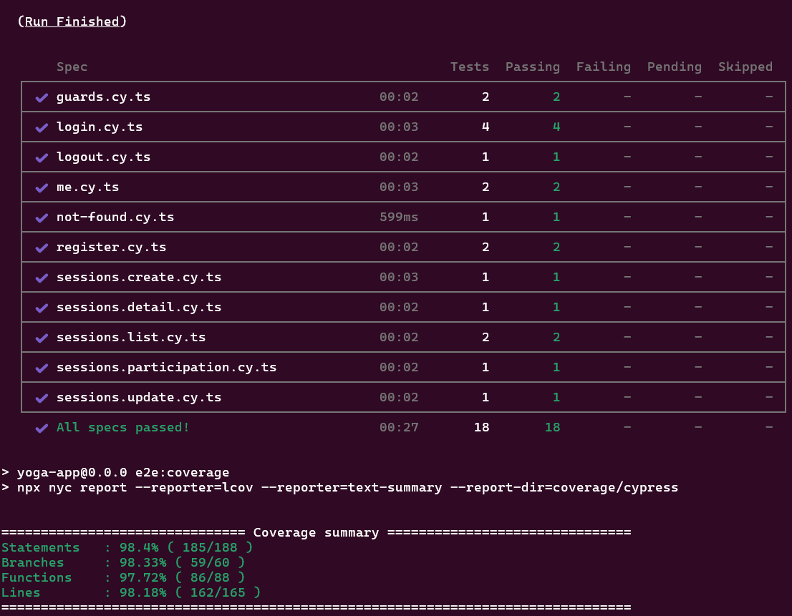
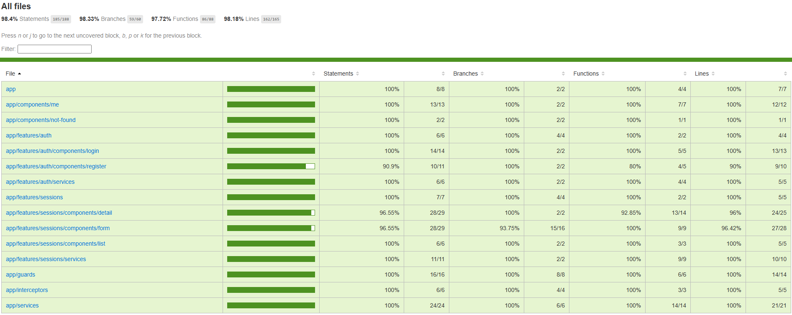

# Yoga App — Installation, Exécution et Tests

## Contexte et objectifs
Application **Yoga App** (Frontend Angular, Backend Spring Boot, MySQL) avec jeux de tests **front**, **back** et **end-to-end**.  
Objectif qualité : **≥ 80 % de couverture** sur chaque partie (instructions/branches/lignes), avec des **tests unitaires et d’intégration**.

## Stack technique
- Frontend : Angular, Node.js  
- Backend : Java (Spring Boot), Maven  
- Base de données : MySQL  
- E2E : Cypress

## Prérequis

- [Installation de Docker & Docker Compose](https://docs.docker.com/get-started/get-docker/)

## Installation
Cloner le dépôt puis se placer à la racine :
```bash
git clone https://github.com/bem92/yoga-app.git
cd yoga-app
```

## Lancer les services (Docker)
Un `docker-compose.yml` (et un `Dockerfile` pour le front) sont fournis.

Démarrage :
```bash
docker compose up -d
```

Cette commande démarre :
- MySQL (initialisée via `./ressources/sql/script.sql`)  
- Backend Spring Boot sur `http://localhost:8080`  
- Frontend Angular sur `http://localhost:4200`

Conteneurs attendus : `yoga-mysql`, `yoga-backend`, `yoga-angular`.  
Les identifiants en clair sont destinés au **développement local**.

## Comptes de test
- Admin : `yoga@studio.com` / `test!1234`

---

## Tests & rapports (avec Docker)

> Pré-requis : les conteneurs sont démarrés via `docker compose up -d`.

### 1) Frontend (Jest)
Exécution :
```bash
docker exec -it yoga-angular npm test -- --coverage --runInBand
```
Rapport HTML : **front/coverage/jest/lcov-report/index.html**

**Sortie terminal :**

**Capture rapport :**


---

### 2) Backend (JUnit/Mockito + JaCoCo)
Exécution :
```bash
docker exec -it yoga-backend mvn -q -B clean test
```
Rapport HTML : **back/target/site/jacoco/index.html**

**Capture rapport :**


---

### 3) End-to-End (Cypress)
Exécution :
```bash
docker exec -it yoga-angular npm run e2e:ci
docker exec -it yoga-angular npx cypress run
```
Rapport HTML de couverture E2E : **front/coverage/lcov-report/index.html**  


**Sortie terminal :**

**Capture rapport :**


---

## Récapitulatif des rapports
- Front (Jest) : `front/coverage/jest/lcov-report/index.html`  
- Back (JaCoCo) : `back/target/site/jacoco/index.html`  
- E2E (Cypress) : `front/coverage/lcov-report/index.html`